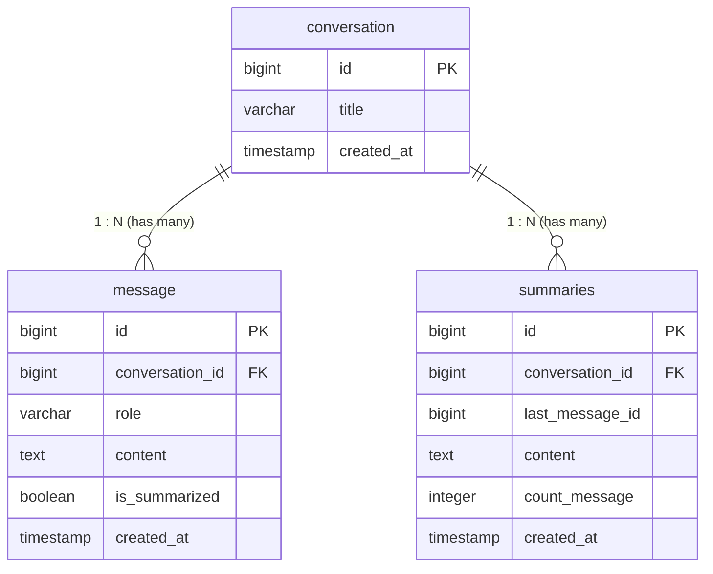

# 9Router CLI (Spring Shell AI)

CLI interaktif berbasis Spring Shell untuk chatting dengan OpenAI-compatible API (9Router / local LLM) langsung dari terminal. Dilengkapi fitur streaming output dan pencatatan history percakapan ke PostgreSQL.

## Fitur

- Chat interaktif langsung di terminal dengan typewriter effect
- Streaming response (SSE)
- Pilihan model dinamis lewat parameter `-m` atau default config
- Cek ketersediaan model (`models`) dan status server (`status`)
- Simpan riwayat percakapan ke database PostgreSQL

## Kebutuhan Sistem

- Java 17+
- PostgreSQL
- Server AI yang kompatibel dengan OpenAI API (misal: 9Router / vLLM / Ollama)

## Setup & Konfigurasi

1. Salin file template config:
   ```bash
   cp src/main/resources/application.properties.example src/main/resources/application.properties
   ```

2. Sesuaikan isi `src/main/resources/application.properties`:
   ```properties
   # Konfigurasi AI Server
   spring.ai.openai.api-key=YOUR_API_KEY
   spring.ai.openai.base-url=http://localhost:20128
   spring.ai.openai.chat.model=YOUR_COMBO

   # Konfigurasi Database
   spring.datasource.url=jdbc:postgresql://localhost:5432/YOUR_DB
   spring.datasource.username=postgres
   spring.datasource.password=YOUR_PASSWORD
   ```

## Menjalankan Aplikasi

Jalankan langsung dengan Maven Wrapper:

```bash
./mvnw spring-boot:run
```

Atau build ke JAR terlebih dahulu:

```bash
./mvnw clean package -DskipTests
java -jar target/demo-0.0.1-SNAPSHOT.jar
```

## Penggunaan Command

| Command | Alias | Keterangan |
| :--- | :--- | :--- |
| `chat` | `cht` | Masuk mode chat interaktif (menggunakan default model) |
| `chat -m <model>` | `cht -m <model>` | Chat menggunakan model spesifik |
| `models` | `mdl` | Menampilkan daftar model yang tersedia di server |
| `status` | `sts` | Mengecek status koneksi ke router |
| `help` | | Melihat semua command yang tersedia |
| `exit` | | Keluar dari aplikasi |

Saat berada di dalam mode **chat**:
- Ketik `/clear` untuk mereset riwayat chat sesi saat ini.
- Ketik `/exit` untuk kembali ke menu shell utama.

## Arsitektur & Relasi Database

Aplikasi menggunakan PostgreSQL untuk menyimpan riwayat sesi, log pesan, dan memory compression (ringkasan percakapan).

### Skema & Relasi Entitas (ERD)



### Detail Tabel & Relasi

1. **`conversation` (`ConversationEntity`)**
   - Menyimpan sesi percakapan utama.
   - Kolom:
     - `id` (PK, BigInt Auto Increment)
     - `title` (Varchar, judul percakapan diambil dari input pertama user max 50 karakter)
     - `created_at` (Timestamp, waktu dibuat)
   - **Relasi**:
     - `1 : N` ke tabel `message` (Satu percakapan memiliki banyak pesan).
     - `1 : N` ke tabel `summaries` (Satu percakapan dapat memiliki riwayat ringkasan bertahap).

2. **`message` (`MessageEntity`)**
   - Menyimpan setiap interaksi chat (user maupun assistant).
   - Kolom:
     - `id` (PK, BigInt Auto Increment)
     - `conversation_id` (FK ke `conversation.id`, `ManyToOne`, Not Null)
     - `role` (Varchar: `"user"` atau `"assistant"`)
     - `content` (Text, isi pesan)
     - `is_summarized` (Boolean, penanda apakah pesan sudah diproses ke dalam ringkasan)
     - `created_at` (Timestamp, waktu dibuat)

3. **`summaries` (`SummaryEntity`)**
   - Menyimpan hasil kompresi/ringkasan memori dari pesan-pesan lama.
   - Kolom:
     - `id` (PK, BigInt Auto Increment)
     - `conversation_id` (FK ke `conversation.id`, `ManyToOne`, Not Null)
     - `last_message_id` (BigInt, ID pesan terakhir yang tercakup dalam batch ringkasan ini)
     - `content` (Text, isi ringkasan terakumulasi)
     - `count_message` (Integer, jumlah pesan yang diringkas pada batch tersebut)
     - `created_at` (Timestamp, waktu dibuat)

---

## Logika & Alur Sistem

### 1. Alur Mode Chat (`ChatCommand`)
- **Inisialisasi History**:
  Saat command `chat` dijalankan, context memory dibentuk dari:
  1. Ringkasan terbaru (`summaries`) jika ada, dimasukkan sebagai pesan `system`:
     `"Konteks percakapan sebelumnya (ringkasan): ..."`
  2. 5 pesan terakhir (`message`) untuk menjaga kelancaran alur obrolan langsung.
- **Penyimpanan Percakapan**:
  - Pada pesan pertama (`saveFirstChat`), entitas `conversation` dibuat dengan `title` dari input pertama.
  - Setelah respons AI berhasil diterima via streaming, kedua pesan (`user` dan `assistant`) disimpan ke tabel `message`.
  - Pemicu background summarizer (`summarizerService.summarizeIfNeeded()`) dipanggil secara asynchronous.

### 2. Alur & Logika Ringkasan (`SummarizerService`)
Untuk menjaga ukuran prompt tetap hemat token namun ingatan percakapan tetap terjaga:
- **Batching Threshold**: Peringkasan dijalankan secara background (`@Async`) hanya jika pesan yang belum diringkas (`is_summarized = false`) mencapai minimal **10 pesan** (`BATCH_SIZE = 10`).
- **Concurrency Guard**: Menggunakan `AtomicBoolean` (`running`) untuk mencegah dua proses peringkasan berjalan bersamaan.
- **Akumulasi Konteks**: Mengambil ringkasan terakhir (`oldSummary`) digabungkan dengan 10 pesan baru tertua yang belum diringkas, lalu dikirim ke AI summarizer.
- **Pembaruan Transaksional**:
  - Menyimpan ringkasan baru ke tabel `summaries`.
  - Menandai 10 pesan tersebut dengan `is_summarized = true`.

---

## Aturan Ringkasan (Summary Rules)

Pembuatan ringkasan dijalankan oleh modul `SummaryGenerate` dengan panduan sistem (system prompt) ketat:

- **Fokus Esensial**: Hanya mencatat fakta tentang user, preferensi, keputusan penting, tugas aktif, angka/nama/istilah kunci, dan pertanyaan yang belum terjawab.
- **Eliminasi Noise**: Basa-basi, sapaan pembuka/penutup, dan topik yang sudah selesai dieliminasi.
- **Format Padat**: Ditulis dalam format poin-poin ringkas, bukan kalimat utuh yang menyalin perkataan asli.
- **Resolusi Konflik**: Apabila ada informasi baru yang bertentangan dengan informasi pada ringkasan lama, gunakan informasi yang paling baru.
- **Penanganan Kode**: Tidak menyalin potongan kode; hanya mencatat tujuan kode serta nama file/fungsi yang relevan.
- **Batasan Panjang**: Maksimal **250 kata**; prioritaskan membuang rincian sekunder jika melebihi batas.
- **Bahasa**: Mengikuti bahasa percakapan yang digunakan.
- **Output Bersih**: Mengembalikan langsung isi ringkasan tanpa teks pengantar atau penutup.
